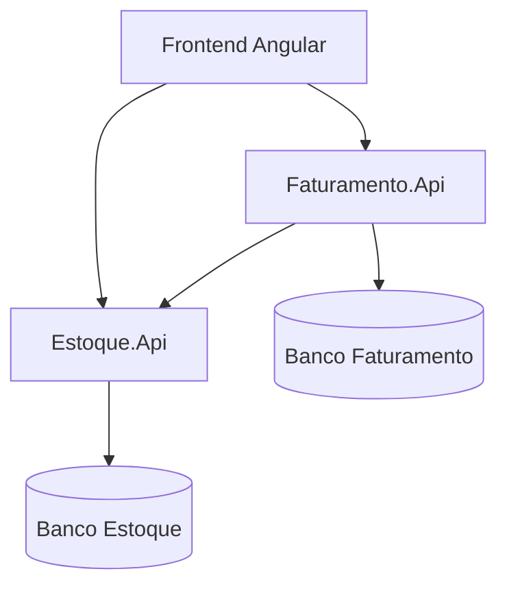

# Sistema de Emissão de Notas Fiscais

Aplicação desenvolvida para o desafio técnico da Korp, com o objetivo de gerenciar produtos, saldos de estoque e emissão de notas fiscais utilizando uma arquitetura baseada em microsserviços.

O sistema permite cadastrar produtos, criar notas fiscais com múltiplos itens, consultar seus detalhes e processar a impressão. A impressão fecha a nota fiscal e realiza a baixa das respectivas quantidades no estoque.

## Funcionalidades

### Produtos

- Cadastro de produtos;
- Código do produto padronizado no formato `ABCD-1234`;
- Validação de código duplicado;
- Cadastro de descrição e saldo inicial;
- Listagem paginada de produtos;
- Consulta do saldo disponível.

### Notas fiscais

- Criação de notas fiscais com múltiplos produtos;
- Numeração sequencial gerada pelo backend;
- Status inicial `Aberta`;
- Validação de produtos duplicados na mesma nota;
- Validação das quantidades solicitadas;
- Listagem das notas fiscais;
- Visualização dos detalhes;
- Impressão pelo navegador, com possibilidade de salvar como PDF;
- Fechamento da nota após o processamento da impressão;
- Bloqueio da impressão de notas diferentes de `Aberta`;
- Baixa automática dos saldos no microsserviço de Estoque.

### Tratamento de falhas

- Tratamento centralizado de exceções nas APIs;
- Respostas de erro padronizadas com `ProblemDetails`;
- Exceções específicas para regras de negócio;
- Feedback visual no frontend;
- Tratamento da indisponibilidade do microsserviço de Estoque;

## Arquitetura

O backend foi dividido em dois microsserviços:

- **Estoque.Api:** responsável pelos produtos, saldos e operações de baixa;
- **Faturamento.Api:** responsável pela criação, consulta, fechamento e impressão das notas fiscais.



O Faturamento consulta o Estoque durante a criação da nota e solicita a baixa dos produtos durante a impressão. As regras de saldo permanecem sob responsabilidade do microsserviço de Estoque.

## Tecnologias utilizadas

### Backend

- C#;
- .NET 10;
- ASP.NET Core Web API;
- Entity Framework Core;
- PostgreSQL;
- Npgsql;
- Swagger/OpenAPI;
- `HttpClientFactory` para comunicação entre microsserviços;
- `IExceptionHandler` e `ProblemDetails` para tratamento de erros;

### Frontend

- Angular 20 com componentes standalone;
- TypeScript;
- RxJS;
- Angular Signals;
- Reactive Forms e `FormArray`;
- Lazy Loading;
- PrimeNG 20;
- PrimeIcons;
- Tailwind CSS;
- ngx-spinner;
- ngx-mask.

### Infraestrutura

- Docker;
- Docker Compose;
- PostgreSQL em container;
- Git e GitHub.

## Estrutura do projeto

```text
.
├── backend/
│   ├── Estoque.Api/               # Produtos, saldos e baixas de estoque
│   └── Faturamento.Api/            # Criação e impressão de notas fiscais
├── frontend/
│   └── korp-web/                   # Aplicação Angular
├── docker-compose.yml              # Bancos e serviços executados por Docker
├── .gitignore                      # Arquivos ignorados pelo Git
└── README.md                       # Documentação do projeto
```

### Organização do Angular

```text
src/app/
├── core/
│   ├── interceptors/               # Comportamentos globais das requisições
│   └── services/                   # Logger e controle de loading
├── features/
│   ├── produtos/                   # Cadastro e listagem de produtos
│   └── notas-fiscais/              # Criação, consulta e impressão de notas
├── layout/
│   └── main-layout/                # Cabeçalho, navegação e conteúdo principal
├── app.config.ts                   # Providers globais
└── app.routes.ts                   # Rotas principais e Lazy Loading
```

Cada feature mantém seus próprios `models`, `services`, `components`, `pages` e rotas. Os dialogs pertencentes exclusivamente a uma feature permanecem dentro dela.

## Pré-requisitos

Para executar o projeto, é necessário possuir:

- [.NET SDK 10](https://dotnet.microsoft.com/download);
- [Node.js 22](https://nodejs.org/);
- npm;
- [Docker Desktop](https://www.docker.com/products/docker-desktop/);
- Git.

Verifique as instalações:

```bash
dotnet --version
node --version
npm --version
docker --version
docker compose version
```

## Como executar

### 1. Clone o repositório

```bash
git clone https://github.com/JonathanJHK/Korp_Teste_JonathanHeidyKinjo.git
cd Korp_Teste_JonathanHeidyKinjo
```

Substitua a URL acima pela URL pública definitiva do repositório.

### 2. Inicie os bancos de dados

Na raiz do projeto:

```bash
docker compose up -d
```

Confira os containers:

```bash
docker compose ps
```

### 3. Aplique as migrations

Na raiz do projeto:

```bash
dotnet ef database update \
  --project backend/Estoque.Api \
  --startup-project backend/Estoque.Api
```

```bash
dotnet ef database update \
  --project backend/Faturamento.Api \
  --startup-project backend/Faturamento.Api
```

No PowerShell, os comandos também podem ser executados em uma única linha.

### 4. Execute o microsserviço de Estoque

```bash
dotnet run --project backend/Estoque.Api
```

### 5. Execute o microsserviço de Faturamento

Em outro terminal:

```bash
dotnet run --project backend/Faturamento.Api
```

As URLs HTTP e HTTPS utilizadas localmente são exibidas no terminal e também podem ser consultadas nos arquivos `Properties/launchSettings.json` de cada API.

O Swagger estará disponível em:

```text
<URL_DA_API>/swagger
```

### 6. Configure as URLs do frontend

Confira `frontend/korp-web/src/environments/environment.ts`:

```typescript
export const environment = {
  production: false,
  apiUrls: {
    estoque: 'http://localhost:5090',
    faturamento: 'http://localhost:5147',
  },
};
```

As URLs devem corresponder às URLs HTTP informadas pelas APIs. Não utilize uma URL HTTPS apontando para uma porta HTTP.

### 7. Execute o frontend

```bash
cd frontend/korp-web
npm install
npm start
```

A aplicação estará disponível normalmente em:

```text
http://localhost:4200
```

## Fluxo principal

1. Acesse **Produtos**;
2. Cadastre um produto informando código, descrição e saldo;
3. Acesse **Notas fiscais**;
4. Crie uma nota selecionando um ou mais produtos e suas quantidades;
5. Consulte a nota pelo dialog de detalhes;
6. Clique em **Imprimir**;
7. Confirme a operação;
8. O Faturamento solicita a baixa ao Estoque;
9. A nota é alterada para `Fechada`;
10. O navegador abre a visualização de impressão;
11. O novo saldo pode ser consultado na listagem de produtos.

## Regras de negócio

- O código do produto segue o formato de quatro letras, hífen e no mínimo quatro números, como `ABCD-1234`;
- A padronização e a validação definitiva do código são realizadas no backend;
- O frontend utiliza máscara para auxiliar o usuário;
- Uma nota precisa possuir pelo menos um item;
- Um produto não pode aparecer repetido na mesma nota;
- A quantidade deve ser maior que zero;
- A quantidade não pode ultrapassar o saldo disponível;
- Toda nota é criada com status `Aberta`;
- Somente notas abertas podem ser impressas;
- A impressão fecha a nota e realiza a baixa no estoque;
- Uma nota fechada não pode ser processada novamente.

## Tratamento de erros no backend

As APIs utilizam implementações de `IExceptionHandler` para converter exceções em respostas HTTP padronizadas no formato `ProblemDetails`.

Exemplos de situações tratadas:

- dados inválidos;
- recurso não encontrado;
- código de produto duplicado;
- saldo insuficiente;
- nota já fechada;
- indisponibilidade de outro microsserviço;
- erro interno inesperado.

O uso de `ProblemDetails` fornece campos como `status`, `title` e `detail`, permitindo que o frontend apresente mensagens adequadas ao usuário.

## Comunicação entre microsserviços

O `Faturamento.Api` utiliza um cliente HTTP tipado para conversar com o `Estoque.Api`. O endereço do Estoque é definido por configuração e injetado por meio do `HttpClientFactory`.

Quando o Estoque está indisponível, a falha de comunicação é convertida em uma exceção específica. O frontend recebe uma resposta apropriada e informa que o serviço não está disponível, sem permanecer em loading indefinidamente.

## Angular: ciclos de vida e gerenciamento de estado

Foi utilizado o ciclo de vida `OnInit` nas páginas que precisam carregar dados assim que são abertas, como as listagens de produtos e notas fiscais e o formulário de criação da nota.

Signals foram utilizados para estados locais, por exemplo:

- listas de produtos e notas;
- abertura e fechamento dos dialogs;
- item selecionado;
- estado de envio dos formulários;
- nota preparada para impressão.

## Uso de RxJS

O Angular `HttpClient` retorna Observables. Neste projeto, RxJS foi utilizado para:

- executar requisições HTTP por meio de `subscribe`;
- tratar sucesso e erro das operações;
- executar limpeza com `finalize`;
- controlar o loading global em um interceptor HTTP;
- garantir que botões sejam reabilitados após o término das requisições.

O loading global utiliza um contador para suportar múltiplas requisições simultâneas sem esconder o spinner antes da finalização de todas elas.

## Uso de LINQ

LINQ foi utilizado no backend para trabalhar com coleções e consultas ao banco, incluindo operações como:

- busca e filtragem de registros;
- projeção de entidades para DTOs;
- verificação de produtos duplicados;
- seleção dos identificadores dos produtos;
- validação dos itens das notas fiscais.

As consultas executadas sobre o Entity Framework Core são traduzidas para SQL sempre que aplicável.

## Bibliotecas do frontend

| Biblioteca   | Finalidade                                                             |
| ------------ | ---------------------------------------------------------------------- |
| PrimeNG      | Tabelas, botões, dialogs, selects, inputs, tags, toasts e confirmações |
| PrimeIcons   | Ícones da interface                                                    |
| Tailwind CSS | Layout responsivo e estilos utilitários                                |
| ngx-spinner  | Indicador global de processamento                                      |
| ngx-mask     | Máscara do código do produto                                           |
| RxJS         | Fluxos assíncronos e requisições HTTP                                  |

## Cenário de falha demonstrável

Para demonstrar a recuperação de uma falha entre microsserviços:

1. Mantenha o Faturamento em execução;
2. Interrompa o microsserviço de Estoque;
3. Tente criar ou imprimir uma nota fiscal;
4. O Faturamento identifica a falha de comunicação;
5. A API retorna um erro padronizado;
6. O Angular encerra o loading e apresenta uma mensagem ao usuário;
7. Reinicie o Estoque e repita a operação.

## Decisões técnicas

- Separação entre Estoque e Faturamento para manter responsabilidades bem definidas;
- DTOs para proteger o contrato externo das entidades de persistência;
- services no Angular responsáveis apenas pela comunicação HTTP;
- componentes responsáveis pela interação e feedback ao usuário;
- dialogs para cadastros curtos e visualização de detalhes;
- página dedicada para criação da nota devido ao formulário dinâmico;
- validações no frontend para experiência do usuário e no backend para garantir as regras;
- Lazy Loading para separar os bundles das features;
- interceptor funcional para centralizar o loading das requisições;
- impressão com CSS próprio e API nativa do navegador.

## Funcionalidades opcionais não implementadas

Os seguintes itens podem ser considerados como evoluções futuras:

- controle avançado de concorrência;
- idempotência distribuída;
- geração de PDF no backend;
- autenticação e autorização;
- observabilidade distribuída;
- retry com política de resiliência;
- uso de Inteligência Artificial.

## Autor

**Jonathan Heidy Kinjo**

- [LinkedIn](https://www.linkedin.com/in/jonathanhkinjo/)
